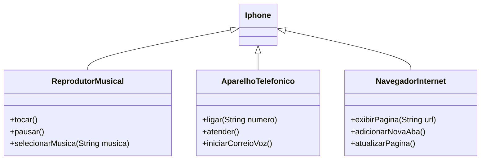

<h1>Desafio que consiste em criar um diagrama com funcionalidades do Iphone 2007</h1>

```mermaid
classDiagram
    Iphone <|-- ReprodutorMusical
    Iphone <|-- AparelhoTelefonico
    Iphone <|-- NavegadorInternet
  
    class ReprodutorMusical{
      +tocar()
      +pausar()
      +selecionarMusica(String musica)
      
    }
    class AparelhoTelefonico{
        +ligar(String numero)
        +atender()
        +iniciarCorreioVoz()
    
    }
    class NavegadorInternet {
    +exibirPagina(String url)
     +adicionarNovaAba()   
    +atualizarPagina()
    }

```
